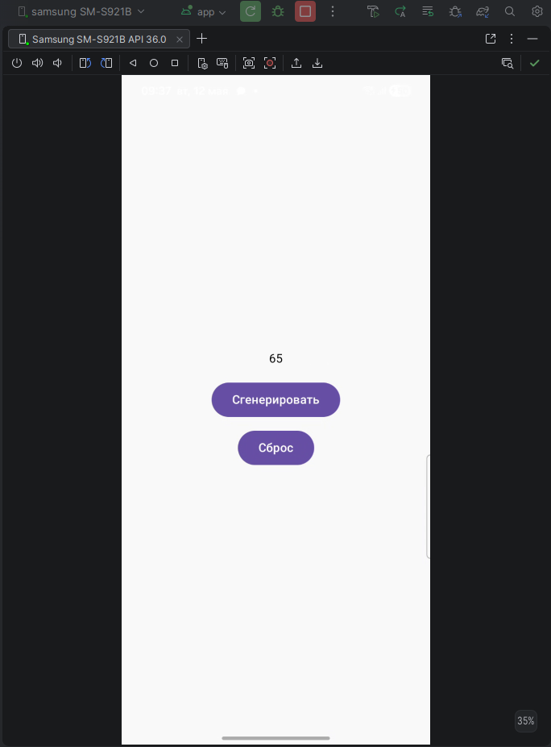
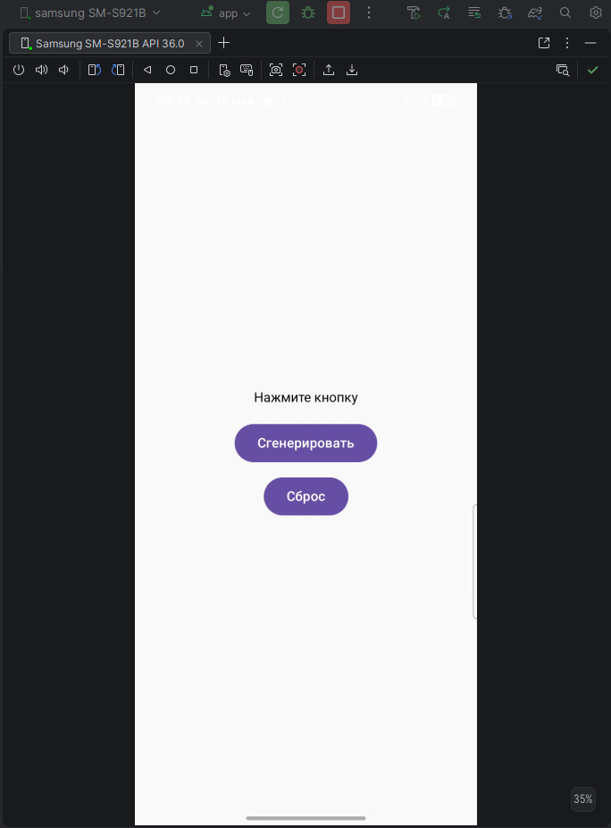
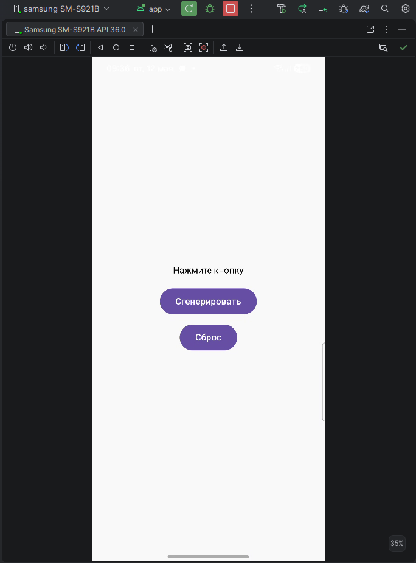

# Экзамен
### Джармоков Мурат ИП-235
### Вариант №8
### Задание: Кнопка «Сгенерировать» и текст, отображающий случайное число от 1 до 100. При каждом нажатии число меняется. Добавьте кнопку «Сброс», которая возвращает текст в состояние «Нажмите кнопку».
```kt
package com.example.ekz_dmr

import android.os.Bundle
import androidx.activity.ComponentActivity
import androidx.activity.compose.setContent
import androidx.compose.foundation.layout.*
import androidx.compose.material3.*
import androidx.compose.runtime.*
import androidx.compose.ui.Alignment
import androidx.compose.ui.Modifier
import androidx.compose.ui.unit.dp
import kotlin.random.Random

class MainActivity : ComponentActivity() {
    override fun onCreate(savedInstanceState: Bundle?) {
        super.onCreate(savedInstanceState)

        setContent {
            var text by remember { mutableStateOf("Нажмите кнопку") }

            Column(
                modifier = Modifier.fillMaxSize(),
                verticalArrangement = Arrangement.Center,
                horizontalAlignment = Alignment.CenterHorizontally
            ) {

                Text(text = text)

                Spacer(modifier = Modifier.height(16.dp))

                Button(onClick = {
                    text = Random.nextInt(1, 101).toString()
                }) {
                    Text("Сгенерировать")
                }

                Spacer(modifier = Modifier.height(8.dp))

                Button(onClick = {
                    text = "Нажмите кнопку"
                }) {
                    Text("Сброс")
                }
            }
        }
    }
}
```
## Скриншоты работы приложения

<div align="center">




</div>

<div align="center">




</div>


